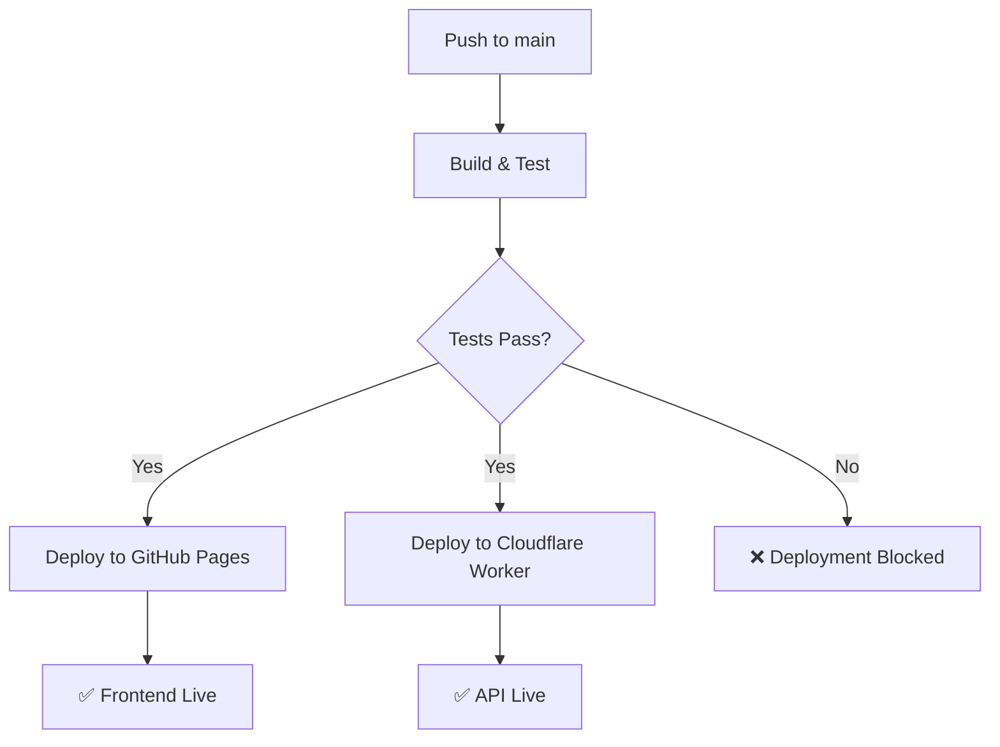

# Deployment Guide

This project deploys to both **GitHub Pages** (Blazor WebAssembly frontend) and **Cloudflare Worker** (serverless API proxy).

## Architecture

```
┌─────────────────────┐
│   GitHub Pages      │
│  (Blazor WASM)      │
│ atniptw.github.io   │
└──────────┬──────────┘
           │
           ├─ API calls →
           │
┌──────────┴──────────┐
│ Cloudflare Worker   │
│ (API Proxy + Cache) │
│ *.workers.dev       │
└─────────────────────┘
           │
           ├─ CORS handled
           ├─ KV caching
           │
           ↓
    Thunderstore API
    (R.E.P.O. community)
```

## GitHub Pages Deployment

**Automated on every push to `main`** (see `.github/workflows/deploy-pages.yml`)

### Build Steps
1. Setup .NET 10.x
2. Restore Blazor WebAssembly workloads
3. Build & Test (Release configuration)
4. Publish Blazor app with AOT compilation
5. Configure base path for GitHub Pages (`/fantastic-octo-waffle/`)
6. Deploy via GitHub Pages API

### Access
- **URL**: https://atniptw.github.io/fantastic-octo-waffle
- **Deployment Status**: GitHub Actions / Pages / Deployments tab

---

## Cloudflare Worker Deployment

**Automated on every push to `main`** (see `.github/workflows/deploy-pages.yml`)

### Prerequisites

You must set up the following GitHub Secrets in your repository settings:

#### Required Secrets:
- **`CLOUDFLARE_API_TOKEN`** - API token with "Workers Scripts - Edit" permission
  - [How to create API token](https://dash.cloudflare.com/?to=/:account/profile/api-tokens)
  - Minimum scope: `Account > Cloud Workers Scripts > Edit`
- **`CLOUDFLARE_ACCOUNT_ID`** - Your Cloudflare Account ID
  - Found in [Cloudflare Dashboard](https://dash.cloudflare.com) → Workers & Pages → Overview

#### Optional Secrets:
- **`CLOUDFLARE_ZONE_ID`** - For custom domain deployments (leave empty for `*.workers.dev`)

### Setup Instructions

1. **Get Cloudflare Account ID**
   - Go to [Cloudflare Dashboard](https://dash.cloudflare.com)
   - Click on any domain or your profile
   - Look for "Account ID" in the sidebar

2. **Create API Token**
   - Go to [API Tokens page](https://dash.cloudflare.com/?to=/:account/profile/api-tokens)
   - Click "Create Token"
   - Choose "Create Custom Token"
   - Set permissions:
     - Account > Cloud Workers Scripts > Edit
     - Account > Workers KV Storage > Edit (for caching)
   - Click "Continue to summary" → "Create Token"
   - Copy the token

3. **Add Secrets to GitHub Repository**
   - Go to GitHub repo → Settings → Secrets and variables → Actions
   - Click "New repository secret"
   - Add:
     - **Name**: `CLOUDFLARE_API_TOKEN` | **Value**: `<paste API token>`
     - **Name**: `CLOUDFLARE_ACCOUNT_ID` | **Value**: `<paste account ID>`

4. **Update wrangler.toml** (if using custom domain)
   - Replace `account_id = "..."` with your Account ID
   - (Optional) Set `zone_id` if deploying to a custom domain

### Build Steps
1. Setup Node.js 24.x
2. Install worker dependencies (`npm ci`)
3. Run worker tests (`npm test`)
4. Deploy to Cloudflare (production environment)

### Access
- **Default URL**: https://repo-mod-viewer-api.workers.dev
- **Deployment Status**: GitHub Actions output or [Cloudflare Dashboard](https://dash.cloudflare.com) → Workers & Pages

### Environment Variables

The worker is deployed with `--env production` which sets:
```toml
ALLOWED_ORIGIN = "https://atniptw.github.io/fantastic-octo-waffle"
ENVIRONMENT = "production"
LOG_LEVEL = "info"
```

Update these in `cloudflare-worker/wrangler.toml` under `[env.production.vars]`.

---

## Manual Deployment

### Deploy Blazor to GitHub Pages
```bash
cd src/BlazorApp
dotnet publish -c Release
```
Output goes to `dist/wwwroot/`, committed to `gh-pages` branch automatically.

### Deploy Worker to Cloudflare
```bash
cd cloudflare-worker
export CLOUDFLARE_API_TOKEN="<your-api-token>"
export CLOUDFLARE_ACCOUNT_ID="<your-account-id>"
npm run deploy -- --env production
```

---

## Troubleshooting

### GitHub Pages Deployment Fails
- Check repository Settings → Pages → Source (should be "GitHub Actions")
- Verify `.nojekyll` file exists in `dist/wwwroot/`
- Check base href matches repository name in `index.html`

### Cloudflare Worker Deployment Fails
- Verify `CLOUDFLARE_API_TOKEN` and `CLOUDFLARE_ACCOUNT_ID` are set in GitHub Secrets
- Check API token has correct permissions (Workers Scripts > Edit)
- Run locally: `cd cloudflare-worker && npm run deploy` to see detailed errors
- Check [Cloudflare Dashboard](https://dash.cloudflare.com) → Workers & Pages → Deployments for logs

### CORS Issues Between Frontend & Worker
- Worker proxy must include CORS headers:
  ```javascript
  const headers = new Headers({
    'Access-Control-Allow-Origin': ALLOWED_ORIGIN,
    'Access-Control-Allow-Methods': 'GET, HEAD, OPTIONS',
  });
  ```
- Frontend uses worker URL: `https://repo-mod-viewer-api.workers.dev`

---

## CI/CD Workflow

The deployment workflow runs automatically on:
- Pushes to `main` branch
- Paths exclude: `*.md`, `docs/**`, `LICENSE`
- Manual trigger: GitHub Actions → "Deploy" → "Run workflow"



---

## References

- [Cloudflare Workers Docs](https://developers.cloudflare.com/workers/)
- [Wrangler CLI](https://developers.cloudflare.com/workers/wrangler/)
- [GitHub Pages with Actions](https://github.blog/changelog/2022-12-09-github-pages-build-and-deployment-through-github-actions/)
- [Blazor WebAssembly Deployment](https://learn.microsoft.com/en-us/aspnet/core/blazor/host-and-deploy)
